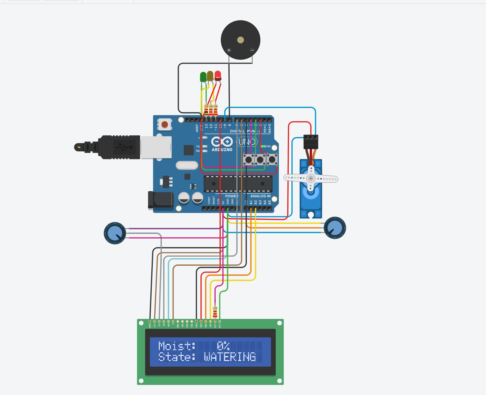
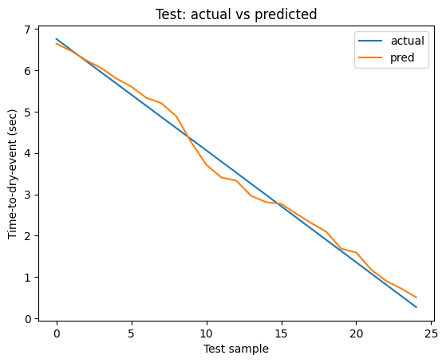

# Moisture Guard (AI + IoT)

Arduino/Tinkercad smart irrigation system: reads soil moisture, shows live status on a 16x2 LCD, and simulates auto-watering via a servo valve + buzzer using a state machine (WET/NORMAL/DRY/WATERING/COOLDOWN). Logs CSV telemetry and includes a Colab notebook to predict time-to-dry event (30% trigger).

## Files
- `moisture_guard.ino` — Arduino code
- `Moisture_Guard_TimeToDryEvent_Tinkercad.ipynb` — ML notebook (Colab)
- `moisture_log_user_clean.csv` — real log from Tinkercad
- `moisture_log_augmented.csv` — repeated cycles + small noise (PoC)
- `circuit.png` — circuit diagram

## Results
- Filtered Baseline MAE (drying segments, slope < -0.02): ~21 sec
- Linear Regression MAE (PoC on augmented cycles): ~0.17 sec

## How to run
Open the notebook in Colab and upload one of the CSV files, then run all cells.

## Screenshots

